# SketchResposive
Design with sketch and export responsive html file。用Sketch 设计和输出响应式H5网页

# Result web

- [Demo1](./web/demo.html)
    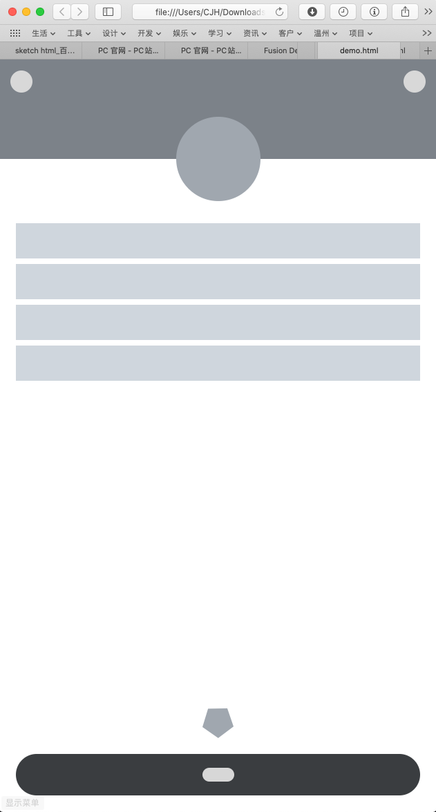

- [Demo2](./web/instacrap.html)
    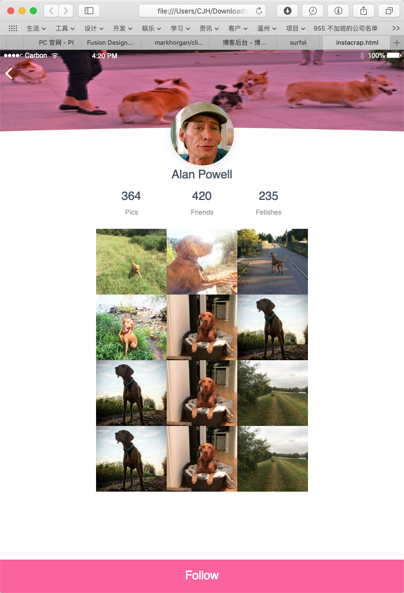

# Doc

<a href="180806.用 Sketch 设计响应式网页.pdf">PDF</a>

# Step snaps

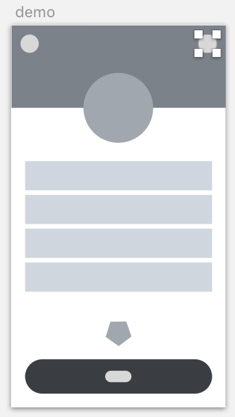
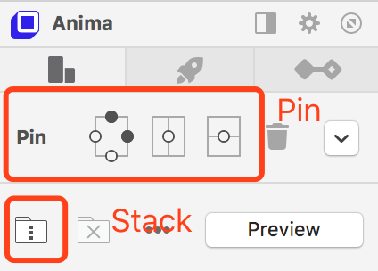
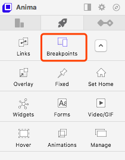
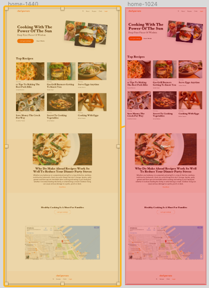
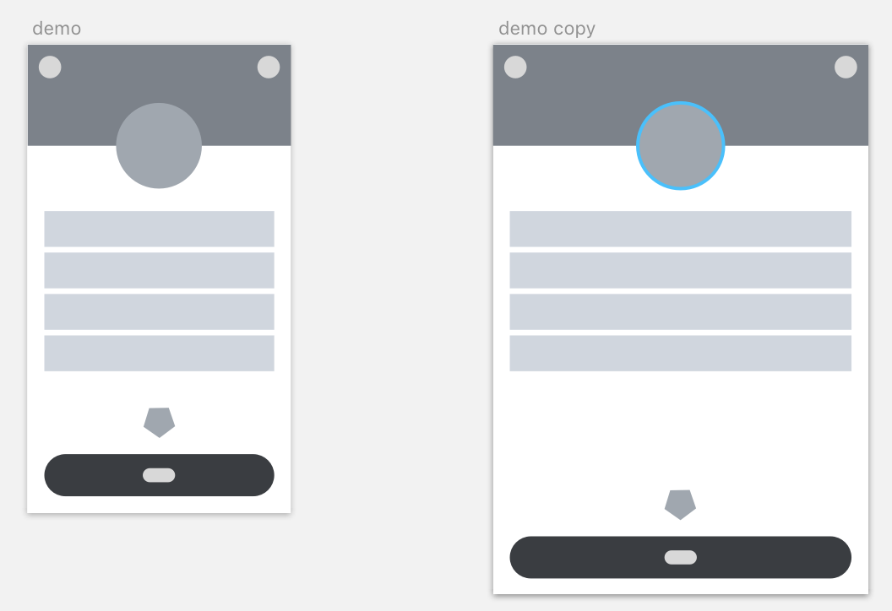
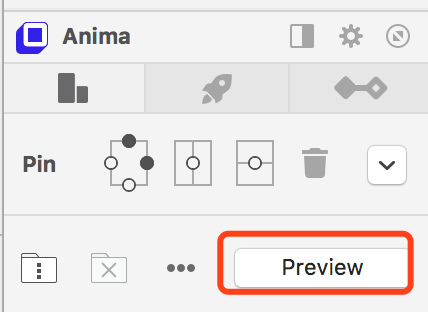
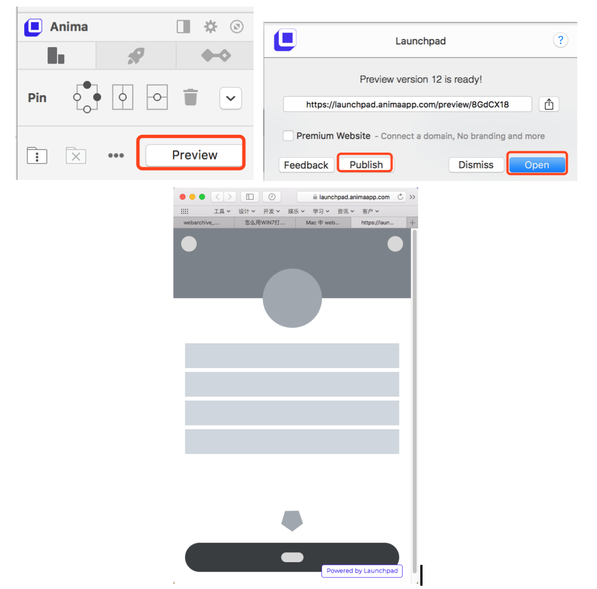
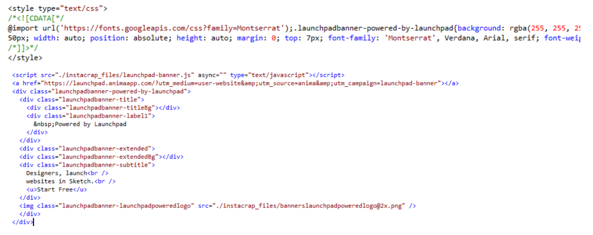
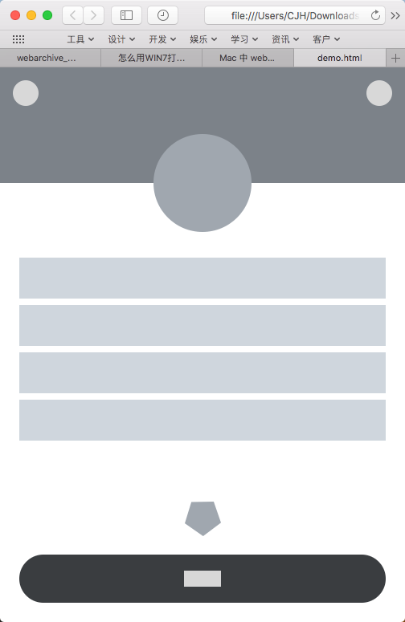

